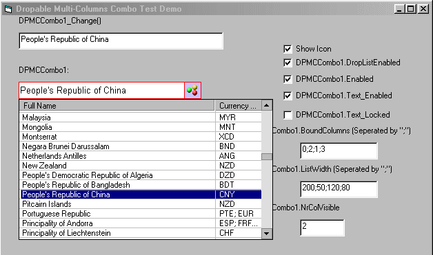



## Multi\-Column Combo\(Updated\)

### Description

Multi-Column Combo using Listview
 
### More Info
 

             |
---                |---
**Submitted On**   |2002-05-30 13:43:14
**By**             |[Zhu JinYong](https://github.com/Planet-Source-Code/PSCIndex/blob/master/ByAuthor/zhu-jinyong.md)
**Level**          |Intermediate
**User Rating**    |5.0 (40 globes from 8 users)
**Compatibility**  |VB 6\.0
**Category**       |[Custom Controls/ Forms/  Menus](https://github.com/Planet-Source-Code/PSCIndex/blob/master/ByCategory/custom-controls-forms-menus__1-4.md)
**World**          |[Visual Basic](https://github.com/Planet-Source-Code/PSCIndex/blob/master/ByWorld/visual-basic.md)
**Archive File**   |[Multi\-Colu883235302002\.zip](https://github.com/Planet-Source-Code/zhu-jinyong-multi-column-combo-updated__1-35266/archive/master.zip)

